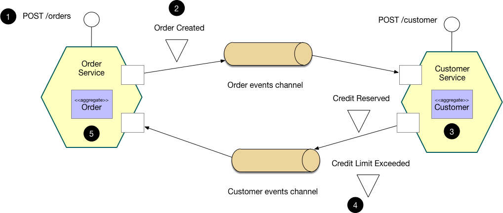

# Messaging

Asynchronous messaging and event-driven communication are essential when propagating changes across multiple services and their related domain models. This pattern provides eventual consistency and event-driven communication.

Transactional support is expected in typical business systems.  Given database per service and that 2 phased distributed transactions are not really an option, messaging through patterns like that Saga Pattern answer that need.  A saga is a sequence of local transactions where on commit a message is published to trigger (choreograph) the next sequence in the saga.

In this example, an order is created by the Order service where a validation of customer available credit is required.  The order is created in a state that denotes the pending response from Customer service to know if the customer has sufficient available credit.

(<https://microservices.io/patterns/data/saga.html>)

It enables an application to maintain data consistency across multiple services without using distributed transactions

A confirmation event is not required for a saga, this could have just as well been the same message consumed by the Inventory service that would then decrement available item inventory.

## Message contents

Most message brokers do not guarantee only once delivery, nor do they guarantee receipt order, so care should be taken with the contents and the reliance on the contents of a message. For example, if order can not be guaranteed and sequencing is not something that can be validated, relying on content in a message may not be correct for applying state changes to an entity.

## Transactional Outbox Pattern

It is common for the publication of a message to happen along with data changes that may be committed to the service's data store.  It is often not possible, viable or desirable to have a message broker participate in a distributed transaction along with the database.  In order to have an atomic transaction that either publishes or rolls back a message publication based on the entire database transaction the Transaction Outbox Pattern is used.

In order to keep the message publication in an atomic transaction with the rest of the operation, messages to be published are written to the same data store as the service uses.  Messages are then read from this data store by a Message Relay in order of message creation and published to the message broker.

The Message Relay process must guarantee at least once publication of a message.  A message consumer must be idempotent in the handling of the message as the message may be delivered more than once (this can happen because of multiple publications OR by broker delivering more than once).

This pattern also adds reliability to message publication in the event that the message broker is unavailable for some reason.

(<https://microservices.io/patterns/data/transactional-outbox.html>)

(<https://github.com/cortside/cortside.domainevent/tree/master/src/Cortside.DomainEvent.EntityFramework>)
