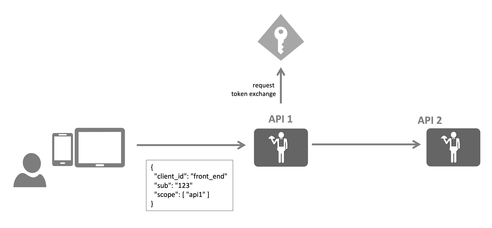

# Token Exchange

Token exchange ([RFC 8693](https://datatracker.ietf.org/doc/html/rfc8693)) is the process for translating between differing token type.  While there are possible other uses, impersonation and delegation are most common.

(<https://docs.duendesoftware.com/identityserver/v5/tokens/extension_grants/token_exchange/>)

## Impersonation

Impersonation is the process by which one subject can act as another subject using that subject's identity and permissions.  In this type of token exchange, the front end subject makes a call to api1 for which it has a scope, api1 then exchange it's own token along with the front end token with scopes to be able to call api2.  In this case, api2 is not aware of api1 at all, it only sees that the front end subject make a call to it.

## Delegation

Delegation is the process by which one subject can act with the identity of another subject but being granted permissions of it's own.  In this type of toke exchange the front end subject makes a call to api1 for which it has a scope, api1 then exchanges it's own token along with the front end token to call api2.  Api2 sees that api1 is making the request and api1's permissions will be validated for the requests.  Api2 can also see that the `actor` is the front end subject and can use that information for the purpose of things like audit logs.
