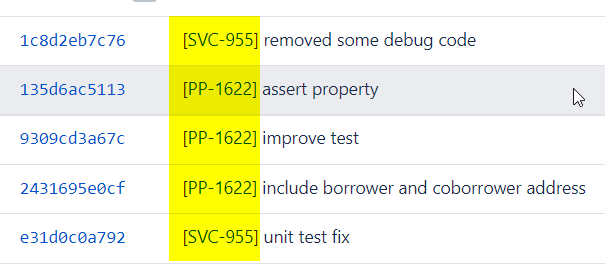
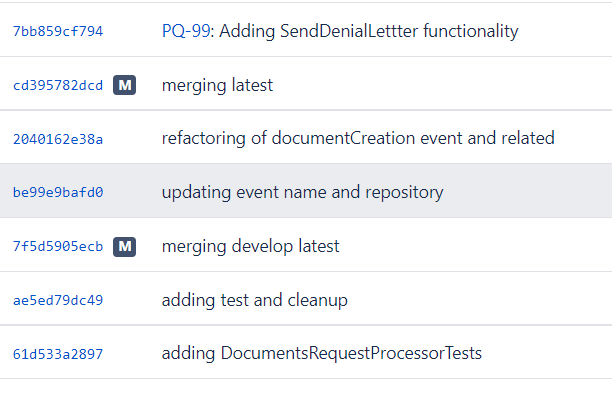

# Git

Things to do:

* Should prefix all commit messages with JIRA ticket related to a commit
  * all commits should be related to a JIRA ticket for tracking
  * `[PRJ-1234] some commit comment` where PRJ-1234 is the JIRA ticket number
  
  DO

  

  DON'T DO

  