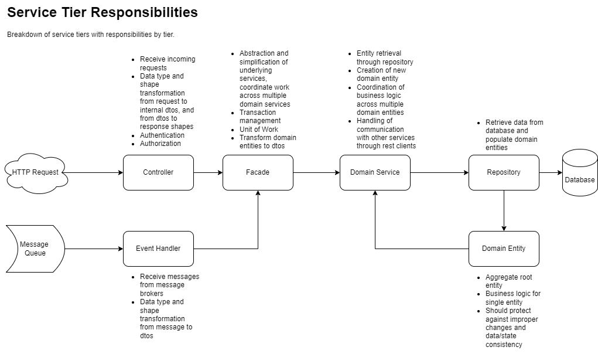

# Service Tier Responsibilities Training

## Talking Points

* discuss the diagram, which will outline the overall goal of the training
* talk about things from bottom up, starting with domain entities. introduce aggregate entities and how they should be thought of as a whole and not as individual tables.
    * point out that these patterns apply no matter what is being used to talk to the db, whether ef core, nhibernate, dapper or just ado.
    * show Order entity with multiple kinds of relationships
        * 1:1 - order to address
        * 1:many - order to orderitems
    * Show the methods that Order entity exposes -- no way of modifying any data from the order class without calling one of it's methods
        * show that properties are get only
        * lists are readonly
        * child entities should have mutation methods as internal -- that way nothing but the parent can change them -- show OrderItem class
    * show constructors on Order entity
        * protected empty constructor for ef
* talk about how repository classes interact with the database
    * show OrderRepository class
    * repository classes return domain entities, not dtos
    * repositories are for getting data from the database, not for updating the database
        * Add and remove can be part of the repository to signal handling by the db context
    * repositories should be singular to a single domain entity aggregate root
    * repostitories should not have any code for changing tracking or for transactions
    * repository classes should not call SaveChangesAsync()
        * if injected with a proper IDatabaseContext, the interface should not have SaveChangesAsync on it anyway
* Talk about search classes and how they are used by repository
    * Show OrderSearch class
        * show how the Build method creates the filter based on the supplied criteria
    * Show OrderRepository
        * Repository search endpoints should return PagedList
* Talk about what the DatabaseContext and it's interfaces should look like
    * Interface should only have DbSets for aggregate roots
    * Can have Remove and RemoveRange if needed when deleting aggregate root children
* Domain services are classes that will handle domain entity creation, getting entity through repository, passing actions to domain entity classes
    * Show OrderService
    * Generally should be singular to a single repository
    * Constructor should have repository and logger.  May also have domainevent publisher and any client classes.
    * domain services should have no access to the db context class in any way
        * won't be able to set tracking
        * won't be able to start a transaction
    * Should return domain entity classes, no mapping to dtos
* Facades should be used to define a single unit of work and the boundaries of an implicit or explicit transaction
    * Show OrderFacade
    * facades may interact with multiple domain services
        * i.e. create order with create customer will use customer service to create the customer and then pass that to the order service for reference
    * unit of work is injected into facade and is implicitly started on instantiation, so no need to start a transaction or to have a using statement to contain scope
        * implicit transactions are completed with SaveChangesAsync()
    * facades can set it's intention of data usage by starting an explicit transaction and setting tracking
        * Show GetOrderAsync and SearchOrdersAsync in OrderFacade
            * point out comments
    * There may be rare cases of requiring a transaction to encompass multiple save changes, but it might be better pattern to just have multiple save checkpoints instead of explicit singular transaction
    * facades should map domain entities to dtos and return only dtos
    * facades will accept dtos as incoming parameters from caller
* Controllers should handle incoming requests and are able to do basic validation on data types and missing required values
    * Show OrderController
    * Show CreateOrderModel
* Mappers
    * Don't use AutoMapper
        * https://cezarypiatek.github.io/post/why-i-dont-use-automapper/
    * Mappers should be handwritten or generated by tools such as MappingGenerator
        * https://marketplace.visualstudio.com/items?itemName=54748ff9-45fc-43c2-8ec5-cf7912bc3b84.MappingGenerator2022

## Reference repositories

* A complete example of c# rest api that is used for the dotnet templates
    * [shoppingcart-api](https://github.com/cortside/coeus/tree/develop/shoppingcart-api)
* Examples of ef core relationship mapping
    * [EF Core example on relationships](https://github.com/cortside/csharp.examples/tree/develop/src/EntityFrameworkCore/Relationships)
* Guidelines
    * [Guidelines](https://github.com/cortside/guidelines/tree/master/docs)
